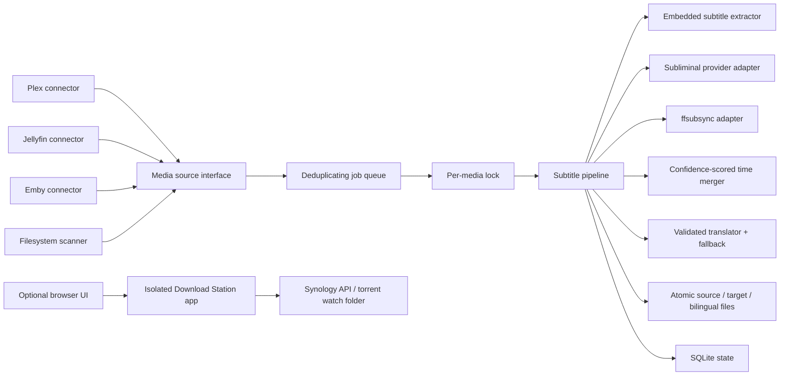

# PairCue architecture

PairCue is a media-server companion service, not a replacement for Plex, Jellyfin, Emby, Bazarr,
Sonarr, or Radarr.

## Requirements and assumptions

- One NAS or home server, normally one worker.
- A library can contain thousands of movies and episodes.
- Translation is slower and more failure-prone than local file operations.
- A partial subtitle is worse than no translated subtitle.
- Download Station is useful, but it must not share media-server or media-library privileges.

## Components

The subtitle service mounts `/media` and receives only the selected media-server and translation
credentials. The Download Station service mounts only `/torrents` and receives only Download
Station credentials. They use different bearer tokens and ports.

## Processing contract

1. Discover the item through the selected connector, map its path under the configured media root,
   and reject paths outside it.
2. Deduplicate the queue and take a lock for the media path.
3. Extract text-based embedded subtitles matching the configured source or target language.
4. When both language tracks exist, synchronize each against the media and merge by temporal
   connected components. Never assume cue numbers or counts match.
5. Require the configured timing-coverage threshold in both tracks before publishing the merged
   bilingual file. This handles one-to-many cue segmentation without silently accepting unrelated
   subtitle releases.
6. Otherwise, download the configured source subtitle when required and synchronize it.
7. Remove non-dialogue cues from the in-memory translation source.
8. Translate in bounded batches. A batch is accepted only when every requested ID appears exactly
   once with non-empty text. Use the fallback provider only after the primary exhausts its retries.
9. Validate complete coverage across the whole file.
10. Write the target-language output and then the bilingual learning output using atomic
   replacements. The bilingual file is the completion marker.
11. Record the result in SQLite.

## Trade-offs

- The first release uses one worker. This is intentionally slower than unrestricted parallelism but
  avoids duplicate translation costs and NAS I/O spikes.
- SQLite is sufficient for one host and keeps installation simple. A distributed queue and database
  should only be considered if PairCue later supports multiple workers.
- Polling is enabled by default on every connector. Webhooks are optional and must supply PairCue's
  bearer token directly or through a trusted reverse proxy.
- Download Station remains in the repository for convenience but runs as a separate process with a
  separate privilege boundary.

## Revisit when the project grows

- Incremental connector cursors and event replay for very large libraries.
- Translation cache keyed by source text, model, prompt version, and glossary version.
- Per-library and per-series language-learning profiles.
- Metrics, structured logs, and an operator dashboard.
- Multiple workers backed by a durable external queue.
