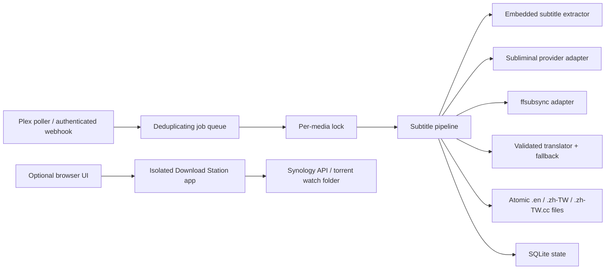

# SubFlow architecture

SubFlow is a Plex companion service, not a replacement for Plex, Bazarr, Sonarr, or Radarr.

## Requirements and assumptions

- One NAS or home server, normally one worker.
- A library can contain thousands of movies and episodes.
- Translation is slower and more failure-prone than local file operations.
- A partial subtitle is worse than no translated subtitle.
- Download Station is useful, but it must not share Plex or media-library privileges.

## Components

The subtitle service mounts `/media` and receives the Plex and translation credentials. The
Download Station service mounts only `/torrents` and receives only Download Station credentials.
They use different bearer tokens and ports.

## Processing contract

1. Resolve the Plex path under the configured media root; reject paths outside it.
2. Deduplicate the queue and take a lock for the media path.
3. Extract text-based embedded subtitles without guessing unknown languages.
4. Download an English base when required and optionally synchronize it.
5. Remove non-dialogue cues from the in-memory translation source.
6. Translate in bounded batches. A batch is accepted only when every requested ID appears exactly
   once with non-empty text. Use the fallback provider only after the primary exhausts its retries.
7. Validate complete coverage across the whole file.
8. Write bilingual output first and `zh-TW` last using atomic replacements. The `zh-TW` file is the
   completion marker.
9. Record the result in SQLite.

## Trade-offs

- The first release uses one worker. This is intentionally slower than unrestricted parallelism but
  avoids duplicate translation costs and NAS I/O spikes.
- SQLite is sufficient for one host and keeps installation simple. A distributed queue and database
  should only be considered if SubFlow later supports multiple workers.
- Polling is enabled by default because native Plex webhooks cannot reliably attach a bearer header.
  Webhooks are optional and intended to sit behind a trusted reverse proxy.
- Download Station remains in the repository for convenience but runs as a separate process with a
  separate privilege boundary.

## Revisit when the project grows

- Incremental Plex pagination and event replay for very large libraries.
- Translation cache keyed by source text, model, prompt version, and glossary version.
- Hong Kong (`zh-HK`) language output.
- Metrics, structured logs, and an operator dashboard.
- Multiple workers backed by a durable external queue.

