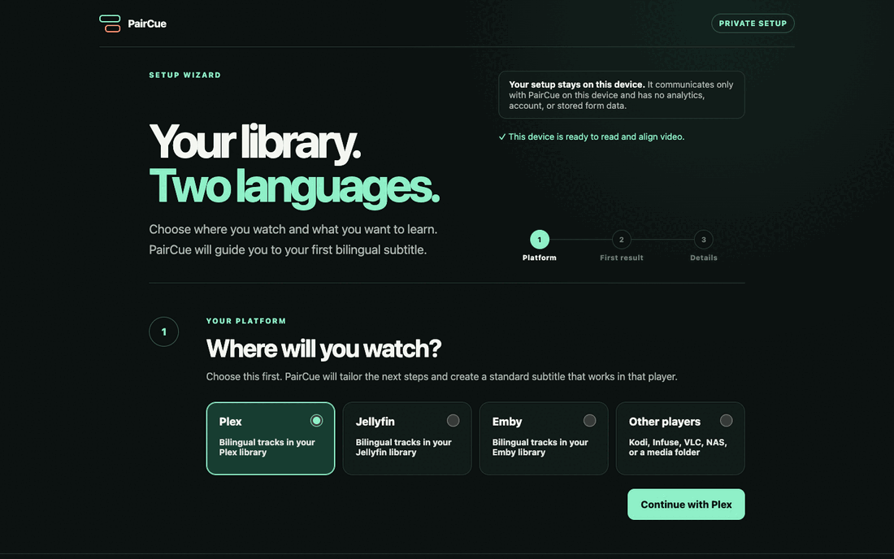

# PairCue

**Make your own media library bilingual.**

PairCue finds, generates, translates, and aligns subtitles for Plex, Jellyfin, Emby, or any media
folder. It saves one ordinary bilingual `.mul.srt` beside your video, ready for the player you
already use.

No custom player. No browser extension. No PairCue account. Your finished subtitle remains yours.

[Download the beta](../../releases) · [Try the safe demo](#choose-your-first-result) ·
[Read the setup guide](docs/CONFIGURATION.md)

```srt
00:00:01,000 --> 00:00:03,520
¿Por dónde empezamos?
Where should we begin?
```

The [complete synthetic demo](examples) belongs to this project and can be regenerated locally
without a server, account, key, or network request.



> PairCue is beta software. Start with a copy of one video or a small test folder.

## Choose your first result

Open PairCue, choose where you watch, then choose the result you want. Technical settings stay
hidden until they are needed.

| Start here | What you need | What PairCue does |
|---|---|---|
| **Try safe demo** | Nothing | Creates a tiny English–Spanish bilingual SRT with project-owned text |
| **Choose two SRTs** | Two subtitle files | Aligns them by time and creates one bilingual SRT |
| **Try one video** | One video | Reuses, finds, or generates subtitles, then translates and pairs them |
| **Automate my library** | A media folder or server connection | Watches the library and processes new videos |

The safe demo is the quickest way to see a finished result. It uses no network, account, media
file, API key, or third-party content. **Choose two SRTs** is the fastest path for your own files;
PairCue never uploads them and refuses to publish a low-confidence pairing.

## Download and open

No Python or terminal is required. Use the direct download for your computer, unzip it, and open
**PairCue**.

| Your computer | Download |
|---|---|
| Apple silicon Mac | [Download PairCue for Apple silicon](https://github.com/zacklam1120-spec/PairCue/releases/download/v0.1.0b12/PairCue-macOS-arm64.zip) |
| Intel Mac | [Download PairCue for Intel Mac](https://github.com/zacklam1120-spec/PairCue/releases/download/v0.1.0b12/PairCue-macOS-x64.zip) |
| Windows | [Download PairCue for Windows](https://github.com/zacklam1120-spec/PairCue/releases/download/v0.1.0b12/PairCue-windows-x64.zip) |
| Linux | [Download PairCue for Linux](https://github.com/zacklam1120-spec/PairCue/releases/download/v0.1.0b12/PairCue-linux-x64.tar.gz) |

These beta apps are not yet signed by Apple or Microsoft. On macOS, right-click PairCue and choose
**Open** the first time. Windows may show an unrecognized-publisher warning. Download only from this
repository; each release includes `SHA256SUMS.txt` for integrity checks.

## Your first subtitle

1. Open PairCue and choose **Plex, Jellyfin, Emby, or Other players**.
2. Choose one of the four first results above.
3. Pick the language spoken in the video and the language you want to read or learn.
4. Follow the fields PairCue reveals, then choose a file or folder when asked.

Progress and the result remain visible on the private setup page. On success, PairCue reveals the
new subtitle in Finder or your file manager. Settings stay on this device and an older setup is
backed up before replacement.

FFmpeg and FFprobe are optional and are not bundled. Search, translation, the safe demo, and pairing
two SRT files work without them. Extracting embedded subtitles, audio-based synchronization, and
speech generation need a separate FFmpeg installation.

Command-line users can pair two files without a media server or account:

```bash
paircue pair Movie.ja.srt Movie.en.srt -o Movie.mul.srt
```

## What PairCue creates

- `Movie.<source>.srt` — synchronized source subtitle when one is found or extracted.
- `Movie.<target>.srt` — the language you want to read or learn.
- `Movie.mul.srt` — both languages sharing one cue timeline.

`mul` is the standard language code for multilingual content. The result works as a normal SRT
sidecar in Plex, Jellyfin, Emby, Kodi, Infuse, VLC, and other players that read external subtitles.
PairCue writes atomically, never overwrites a previous paired result, and publishes no partial
translation when a cue is missing.

## Use any two languages

English and Chinese are defaults, not limits. The spoken and learning languages are independent,
and either one can appear on top.

| Learning goal | Spoken language | Learning language | Result |
|---|---|---|---|
| Learn English from Japanese media | Japanese | English | English + Japanese |
| Learn Japanese with an English base | English | Japanese | Japanese + English |
| Watch with Hong Kong Traditional Chinese | English | Traditional Chinese (Hong Kong) | zh-HK + English |
| Practise French with Spanish media | Spanish | French | French + Spanish |

Regional variants and custom wording styles are supported. See
[configuration and language examples](docs/CONFIGURATION.md#languages-and-line-order).

## Automate your library

After one video works, run PairCue again and choose **Automate my library**. PairCue checks the
folder or server connection before saving, opens a private local dashboard, scans on startup, and
can keep watching for new videos.

| Platform | Library discovery | New-item trigger |
|---|---|---|
| Plex | Authenticated library API | Polling or native webhook |
| Jellyfin | Authenticated user-items API | Polling or Webhook Plugin |
| Emby | Authenticated user-items API | Polling or webhook |
| Kodi, Infuse, VLC, NAS, or media folder | Recursive file scan | Polling |

The finished SRT is portable; Kodi, Infuse, VLC, and other players need no PairCue integration.
For an always-on NAS or home server, follow the [Docker guide](docs/DOCKER.md).

## How the fallback works

PairCue takes the least invasive route that can produce a complete result:

`existing subtitles → official subtitle search → speech transcription → translation → bilingual SRT`

- Existing sidecars are used first.
- Optional search uses the documented OpenSubtitles.com API.
- Optional transcription can generate timed source subtitles when none exist.
- Optional translation creates the learning language.
- Two existing languages are paired without calling a translation provider.

Search, transcription, and translation are opt-in and require your own provider credentials. Setup
explains the requirement before showing the relevant field. Details are in
[Configuration](docs/CONFIGURATION.md).

## Privacy and trust

- Setup and the dashboard bind to the local device; PairCue has no analytics SDK or account.
- Secrets are kept out of URLs and browser storage. Protected actions use authorization headers.
- Media is sent nowhere unless you explicitly enable a translation or transcription provider.
- Media-server paths must resolve inside the folder PairCue is allowed to access.
- Releases include checksums, an SBOM, dependency-license checks, and vulnerability scanning.
- FFmpeg is not bundled. Third-party services remain subject to their own terms and privacy policy.

See [SECURITY.md](SECURITY.md) for security details and private vulnerability reporting.

## Documentation

- [Configuration, providers, languages, pairing, and synchronization](docs/CONFIGURATION.md)
- [Always-on Docker or NAS installation](docs/DOCKER.md)
- [Optional Download Station service](docs/DOWNLOAD_STATION.md)
- [Architecture and trust boundaries](ARCHITECTURE.md)
- [Release changes](CHANGELOG.md)
- [Contribution guide](CONTRIBUTING.md)

## Feedback and development

You do not need to diagnose a technical cause. Use the guided
[bug form](https://github.com/zacklam1120-spec/PairCue/issues/new?template=bug_report.yml) or
[idea form](https://github.com/zacklam1120-spec/PairCue/issues/new?template=feature_request.yml).
Never post credentials, private library paths, or copyrighted subtitle text.

Trying the beta for the first time? Follow the private [10-minute beta mission](docs/BETA_TEST.md),
then tell us whether you reached a real bilingual subtitle with the short
[first-result form](https://github.com/zacklam1120-spec/PairCue/issues/new?template=beta_report.yml).
Nothing is collected automatically.

To install from source, use Python 3.11 or newer:

```bash
python3 -m pip install .
paircue
```

Contributor checks are documented in [CONTRIBUTING.md](CONTRIBUTING.md). Configuration can be
validated without displaying secrets with `paircue doctor` or `paircue doctor --json`.

## Project status and license

PairCue is an independent beta project and is not affiliated with Plex, Jellyfin, Emby, Synology,
subtitle providers, or model providers. Its application logic is independently implemented;
contributions copied or closely adapted from other subtitle products are not accepted.

[MIT](LICENSE). See [DEPENDENCY_POLICY.md](DEPENDENCY_POLICY.md) and
[THIRD_PARTY_NOTICES.md](THIRD_PARTY_NOTICES.md) for dependency, FFmpeg, service, and content
boundaries. This is project documentation, not legal advice.
